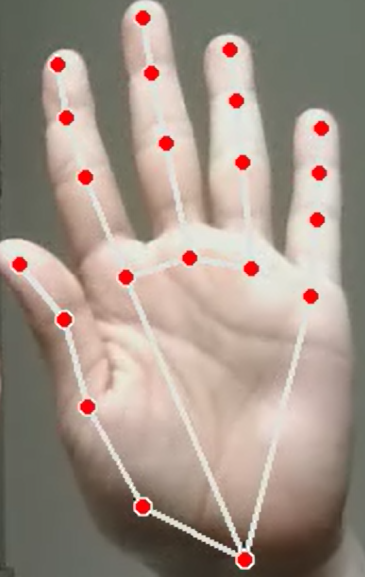
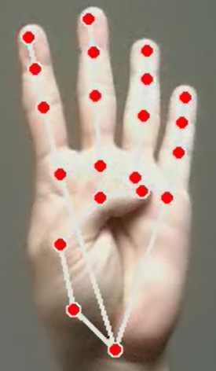
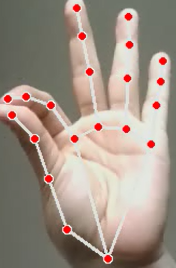
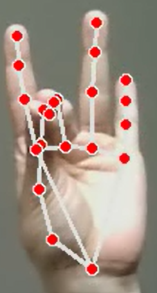
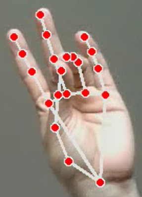
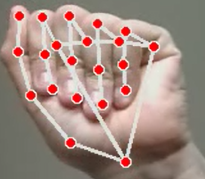

# Touchless Mouse Control

Control your computer mouse using hand gestures and computer vision.

This project uses **MediaPipe Hands**, **OpenCV**, and **PyAutoGUI** to translate real-time hand gestures into mouse actions such as cursor movement, clicks, scrolling, zooming, and drag-and-drop operations.

The system also includes session recording, gesture visualization, and a security mechanism that prevents multi-user interaction by detecting multiple hands.

## Demo

<p align="center">
  
</p>

---

## Features

- Real-time hand tracking
- Cursor movement using hand position
- Left click
- Right click
- Double click
- Drag and drop
- Scroll up
- Scroll down
- Zoom in
- Zoom out
- Cursor freeze mode
- Session recording
- Multi-hand security detection
- Visual action feedback

---

# Gesture Reference

The following images show the hand gestures recognized by the system.

---

## Move Cursor

Move your hand naturally to control the mouse cursor.



---

## Cursor Freeze

Raise all fingers while keeping the thumb down.

This prevents cursor movement while maintaining tracking.



---

## Left Click

Touch the thumb and index finger together.



---

## Right Click

Touch the thumb and middle finger together.



---

## Double Click

Touch the thumb and ring finger together.



---

## Drag and Drop

Close all fingers.

The left mouse button remains pressed while the gesture is maintained.



---

## Scroll Up

Raise only the little finger.


---

## Scroll Down

Raise only the index finger.


---

## Zoom In

Raise the index and middle fingers.

Keep the ring and little fingers down.

Separate the index and middle fingers.


---

## Zoom Out

Raise the index and middle fingers.

Keep the ring and little fingers down.

Bring the index and middle fingers close together.


## Technologies

- Python 3.11
- MediaPipe
- OpenCV
- PyAutoGUI
- NumPy

---

## Project Structure

```text
Touchless_Mouse_Control/
│
├── app.py
├── controller.py
├── requirements.txt
├── environment.yml
├── README.md
│
├── gestures/
│   ├── Moving_cursor.png
│   ├── Cursor_frozen.png
│   ├── Dragging.png
│   └── ...
│
├── records/
│   └── Session recordings
│
└── Fingers_names.png
```

---

## Installation

### Using Conda

Create the environment:

```bash
conda env create -f environment.yml
```

Activate the environment:

```bash
conda activate cursor
```

---

### Using pip

Install dependencies:

```bash
pip install -r requirements.txt
```

---

## Running the Application

```bash
python app.py
```

---

## Security Features

The application includes a security mechanism that monitors the number of visible hands.

If multiple hands are detected for several consecutive frames:

- Mouse control is disabled
- Dragging operations are safely released
- The application automatically closes

This prevents multiple users from interacting with the system simultaneously.

---

## Gesture Reference

### Cursor Movement

Move your hand naturally to control the mouse cursor.


---

### Cursor Freeze

Raise all fingers while keeping the thumb down.


---

### Left Click

Touch the thumb and index finger together.

---

### Right Click

Touch the thumb and middle finger together.

---

### Double Click

Touch the thumb and ring finger together.

---

### Drag and Drop

Close all fingers.


---

### Scroll Up

Raise only the little finger.

---

### Scroll Down

Raise only the index finger.

---

### Zoom In

Raise index and middle fingers while keeping ring and little fingers down.

Separate the index and middle fingers.

---

### Zoom Out

Raise index and middle fingers while keeping ring and little fingers down.

Bring the index and middle fingers close together.

---

## Session Recording

Every application session is automatically recorded.

Recordings are stored inside:

```text
records/
```

Each recording is saved with a timestamp:

```text
record_YYYY-MM-DD_HH-MM-SS.avi
```

---

## Visual Feedback

The application displays the currently detected action directly on the camera feed.

Each action uses a different color for easier visualization.

Examples:

- Green → Cursor Movement
- Yellow → Cursor Frozen
- Cyan → Left Click
- Orange → Right Click
- Red → Double Click
- Purple → Dragging
- Blue → Scrolling

---

## Requirements

- Python 3.11
- Webcam
- Windows 10/11 (tested)

---

## Future Improvements

- Gesture calibration system
- Multi-monitor support
- Gesture customization
- Performance optimization
- User profiles
- Accessibility enhancements

---

## License

This project is released under the MIT License.
